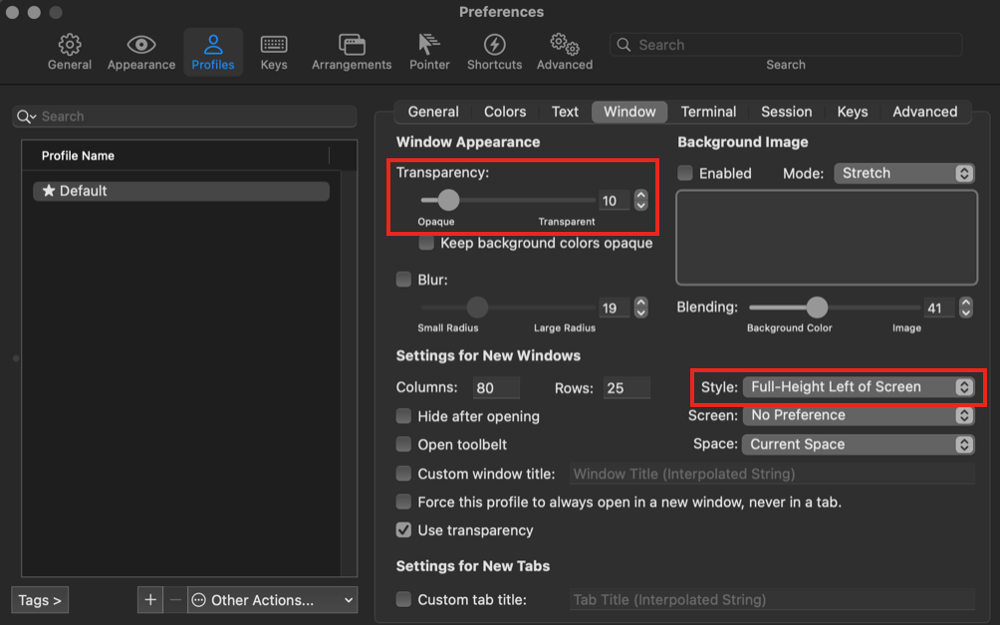
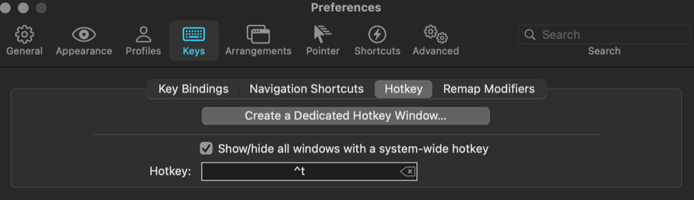
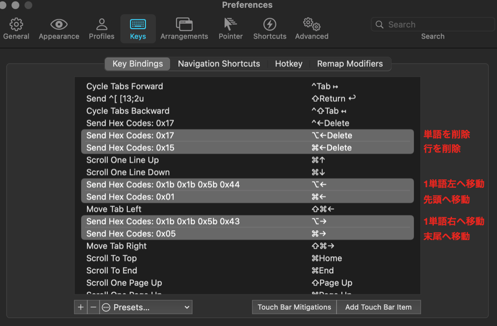

# Preferred Setting on iTerm2

## 1. Window

Open Preferences > Profile > Window

- Transparency: (adjust as you like)
- Style: Full-Height Left of Screen

## 2. Hotkey

Hotkey を押すと iTerm の画面が前面に出てくる

## 3. KeyBindings

Mac/Chrome での一般的な KeyBindings を設定する

## iTerm2 の良さ

- tmux（画面分割）の機能が最初から入っている
  - 縦に分割: cmd+D
  - 横に分割: cmd+shift+D
- 範囲選択するとクリップボードにコピーされる（Ubuntu の標準的な機能）
- cmd+click でリンク/パスを開ける
- toolbelt の Notes 機能
